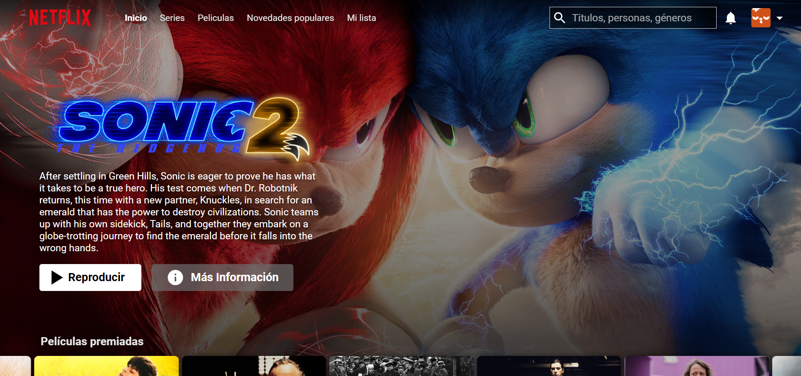

# Clon Netflix 

## Table of contents

- [Overview](#overview)
  - [Screenshot](#screenshot)
  - [Links](#links)
  - [Built with](#built-with)

## Overview

Clon de la webapp Netflix como desafío del bootcamp "Codo a Codo" fullstack React/Go.
Los datos los consulto de la API pública "TMDB" (The Movie Database).
Hosteado en Vercel

[Ir a la Webapp](https://netflix-clon-seven.vercel.app/){:target="_blank"}

### Screenshot

### Links

- Live Site URL: https://netflix-clon-seven.vercel.app/

### Built with

- React.js 
- Axios
- React Router v6
- CSS Vanilla
- MUI (íconos)
- API: https://www.themoviedb.org/